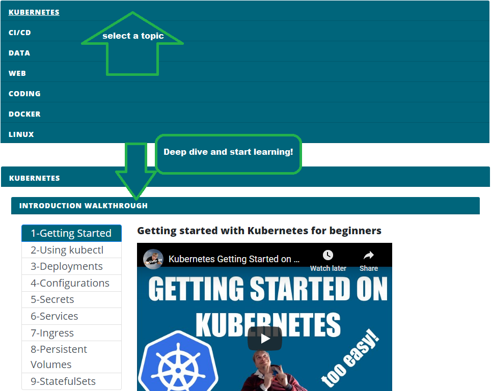

# The Ultimate Engineer Toolbox  :hammer::wrench:

A Collection of tools, hands-on walkthroughs with source code.  
The Ultimate Swiss Army knife for DevOps, Developers and Platform Engineers

 

| Steps  | Playlist :tv: | Source :octocat: | 
|---|---|---|
| Learn Kubernetes :snowflake:  |   | [source]("./kubernetes/README.md")   | 
| Learn about CI/CD tools :whale: |   |   |   |   |
| Deploy Kubernetes to the cloud :partly_sunny: |   | [source]("./kubernetes/cloud/README.md")  | 
| Monitoring Kubernetes :mag: |    | [source]("./monitoring/prometheus/kubernetes/README.md")  | 
| Guide to Logging :page_with_curl: |    | [source]("./monitoring/logging/README.md")  |  
| Guide to ServiceMesh :globe_with_meridians: |    | [source]("./kubernetes/servicemesh/README.md")  |

## Docker Development Basics

| Step :heavy_check_mark:  | Video :movie_camera: | Source Code :octocat: |
|---|---|---|
| Working with `Dockerfiles`  (.NET, Golang, Python, NodeJS) |   | [source](https://github.com/marcel-dempers/docker-development-youtube-series/tree/part1)  |
| Working with code  (.NET, Golang, Python, NodeJS) |   | [source](https://github.com/marcel-dempers/docker-development-youtube-series/tree/part2)  |
| Docker Multistage explained  |   | [source](https://github.com/marcel-dempers/docker-development-youtube-series/tree/part3)  |
| Debugging Go in Docker  |  | [source](https://github.com/marcel-dempers/docker-development-youtube-series/tree/master/golang)  |
| Debugging .NET in Docker  |   | [source](https://github.com/marcel-dempers/docker-development-youtube-series/tree/part5)  |
| Debugging Python in Docker  |   | [source](https://github.com/marcel-dempers/docker-development-youtube-series/tree/debugging-python)  |
| Debugging NodeJS in Docker  |   | [source](https://github.com/marcel-dempers/docker-development-youtube-series/tree/master/nodejs)  |

## Engineering Toolbox :hammer::wrench:

Checkout the toolbox [website](https://marceldempers.dev/toolbox)

