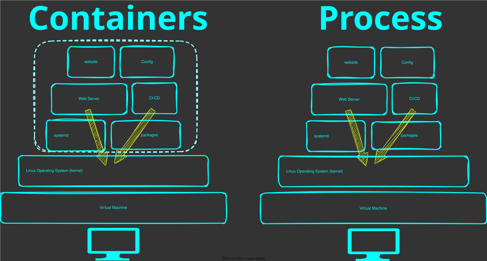
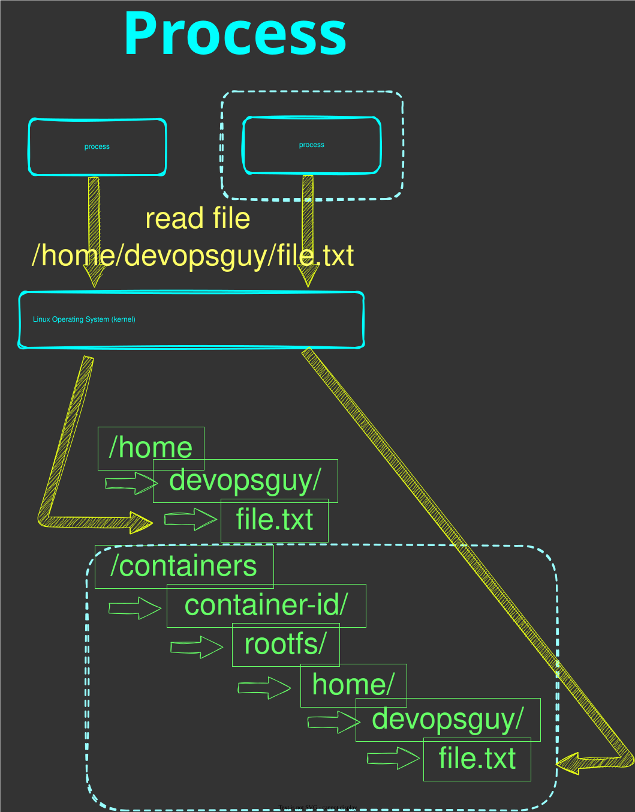
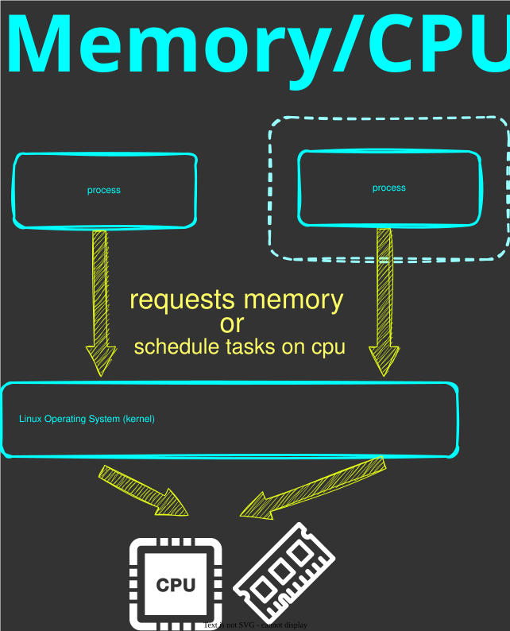
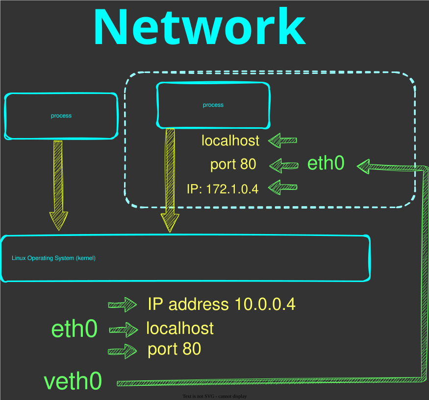
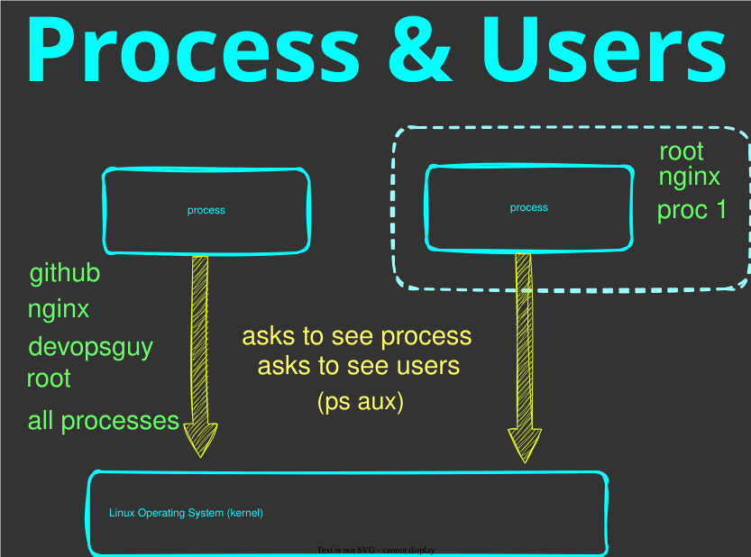

# 🎬 Introduction to Linux containers

## 💡 Preface

This module is part of a course on DevOps. </br>
Check out the [course introduction](../../../README.md) for more information </br>
This module is part of [chapter 6](../../../chapters/chapter-6-docker/README.md)

It is important to take note of the introduction in Chapter 6 because this module, which is the first module on Linux containers, takes everything we've learned from Chapters 1 to 5 and takes it to the next level.

We're going to take a high-level view of what containers are and the differences between containers and virtual machines. We've been running virtual machines from Chapter 1 all the way through to Chapter 5, and we'll continue to run virtual machines, but they serve a different purpose.

Hopefully, after this module, you'll understand exactly what a Linux container is and the challenges and problems that it solves. </br> 
One key thing that I'd like to emphasize is that it is quite difficult for newcomers to understand and really appreciate what Linux containers bring to the table. In Chapters 1 to 5, we focused on problems that existed way back when, from 2005 all the way up to 2015. It's important to take a moment to reflect on Chapters 1 to 5 and all the challenges we saw with scripting, the complexities of package management and dependencies, all the commands we ran on the server to configure it, and the challenges with idempotency, configuration management, and desired state.

In this module, we'll touch on all the key components that solve these challenges (or at least aim to). We'll take a look at what a container is, how to create a container image, and how to run that container image inside of a container. This module will set us up for success so that we can deep dive into all the key aspects of Linux containers in future modules.

This module does not aim to go too deep. The key takeaway is for you to have that "aha!" moment and realize how everything we've done in Chapters 1 to 5 can be optimized, improved, and have a lot of the complexities fall away.

If you're new to containers, my hope is that you also discover a newfound sense of excitement, because containers enable a lot more automation and immutability. They will open the door for you to run and explore complex technologies that were previously very difficult to install prior to containers.

In this course module, I will run the following simple command. </br>
Don't worry about understanding or running this command just yet. </br>
We're going to pay attention to a few things. </br>

```shell
docker run -it -p 8080:80 \
  -v $PWD/nginx.conf:/etc/nginx/nginx.conf \
  -v $PWD/my-website/:/websites/my-website/ \
  nginx:latest
```

With that running, I will open my browser and navigate to our website `http://localhost:8080` </br>

The key benefits you'll notice immediately are:
* Speed (startup time)
* Simplicity (simple command-line statement)
* Lightweight (see below)

To put things in perspective, in Chapter 2 we provisioned a full Virtual Machine to run our web server. </br> 
Let's compare the typical resource overhead of that VM against the lightweight NGINX container we just ran:

| Resource | Virtual Machine (Chapter 2) | Linux Container (NGINX) |
| :--- | :--- | :--- |
| **CPU** | 4 Dedicated Cores | Shared with Host (Minimal) |
| **Memory** | 4096 MB | ~10 - 20 MB |
| **Disk** | 25 GB | ~50 - 150 MB (Image size) |

## What are containers

At its core, a Linux container is a technology that allows us to perform process isolation. </br>
I like to call a container a process sandbox. </br>

I want you to forget the complex terms for now, as they can easily get in the way during an introduction. Linux containers are like an onion with many layers, but it's not worth peeling them all back when you're diving in for the very first time. Once you see a container running and working, we can slowly peel away those layers, one module at a time.



As you can see, the container is a process, exactly as before in previous chapters. </br>
The process is not aware whether it's inside or outside of a container. </br>
Linux primitives create the boundaries that we see above in the illustration. </br>
The primitives control what the container can see. </br>
All access to resources goes through the kernel, and with containers, this doesn't change.

## How processes access a file

When a process wants to access a file, it has to ask the kernel through a system call. </br>
There are system calls like `read`, `write`, `open` and `close`. </br>

We can recap the Linux Chapter, on navigating the filesystem. </br>
When we run `ls /` we see all the files and directories available on Linux. </br>

Notice `bin` and `home` on the host. </br>
When a container runs, it also has its own `bin` and `home`. </br>
The container runtime creates the container's filesystem in a directory on the host and each container gets its own unique directory. </br>
The Linux kernel then "tricks" the process so that when it looks for `/home` or `/bin` it's actually in that unique directory. 

Let's walk through the illustration below:

File system example (When a process asks for a file in home directory):
```
Host Filesystem (/)
├── home/                           ← host's /home
│   └── devopsguy/
├── bin/                            ← host's /bin
│
└── [container root, somewhere]/    ← e.g. /var/lib/docker/overlay2/...
    └── <merged rootfs>/            ← kernel mounts this as container's "/"
        ├── bin/                    ← container's /bin  (isolated from host)
        ├── etc/                    ← container's /etc  (isolated from host)
        └── home/                   ← container's /home (isolated from host)
            └── devopsguy/
```



So when a container process looks at `/home/devopsguy/file.txt`, the kernel resolves that path against the container's mount namespace root, which is really just a directory somewhere under the host filesystem. </br> 

The lesson is, it's the same syscall, same kernel, just a different view.

## How processes access memory/CPU

A process requests Memory the same way whether it's inside or outside the container. </br>
This does not change anything we've learned about how the CPU and Memory work during [Chapter 3](../../../chapters/chapter-3-linux-monitoring/README.md) on Linux monitoring. </br>

CPU and Memory work exactly the same way </br>



Linux has a feature called Control Groups or `cgroups` that allows Linux to place limits on processes. 
We can look at the official definition of [cgroups](https://en.wikipedia.org/wiki/Cgroups)

So `cgroups` are a Linux primitive that helps us limit and isolate processes which helps us contribute to the sandbox. </br>

Memory can easily be limited because its quantity can be allocated to a process, similar to how disk can be allocated. We learned in [Chapter 3](../../../chapters/chapter-3-linux-monitoring/README.md), that CPU is more complicated in that it cannot be directly allocated to a process. 

All processes create "tasks" and the Linux kernel schedules them on CPU. </br>
Remember the "Bicycle theory" we talked about in that Chapter. </br>

The way Linux restricts CPU for processes is also using `cgroups` which throttle CPU time. </br>
This means the Linux kernel will limit how much CPU time a process gets and the process may queue and wait to get its turn on CPU. </br>

The lesson is the same. `cgroups` control how much of a resource any process can use, container or not. It is just a process, and the kernel handles it all </br>

## How processes access the network

A process uses the network stack on a server to access the network. These are components we talked about in earlier chapters, like IP Addresses, networks and ports. </br>

Remember that our virtual machine was part of a virtual network that we've set up in our chapter on virtual servers.

In [Chapter 4](../../../chapters/chapter-4-web-and-http/README.md) (the Web chapter), we learned that an application like a web server binds to an IP address and listens on a specific port (e.g., port 80). We also learned about `localhost` (127.0.0.1) and how we can access local applications via `http://localhost:8080`. We tested this in the abovementioned chapter when running our website. </br>

When you run a process normally on a host, it uses the host's global network stack. </br> 
It sees the host's IP address, the host's network interfaces, and shares the port space. If two applications try to listen on port 80, the second one will crash with a "port already in use" error.



Just as `cgroups` limits resource usage of a process, another Linux primitive called `namespaces` limits what a process can see. </br>

When a container is created, the Linux kernel assigns it its very own isolated network namespace. This means the container gets a brand new, empty network stack:
- Its own private IP address.
- Its own full range of ports (so it can listen on port 80 without conflicting with the host).
- Its own isolated `localhost` loopback interface. 

This is why, inside a container, a web server thinks it has complete ownership of the network. </br>

To make this work, the kernel uses virtual network interfaces to bridge the gap between the host's network and the container's isolated network. </br>

`eth0` on the host system is a real physical Network Interface. <i>(Depending on Physical or Virtual Machine)</i> </br>
A network interface (like `eth0`) is simply the connection point between a device and a network. </br>

In the container world, the kernel creates a pair of virtual interfaces (like a virtual Ethernet cable). </br> 
One end (`veth0`) sits on the host, and the other end becomes the `eth0` interface inside the container.

## More Linux Primitives

So we've now seen how `cgroups` limit what CPU and Memory a container can use </br>
We've seen how `namespaces` can be used to control what networking stacks the process in a container can see </br>
We've also seen how `namespaces` control what a process can see in terms of its file system </br>

Namespaces can further isolate a process by also controlling what other processes and users the process can see:



These namespaces are `pid` namespaces and `user` namespaces. </br>

## What problems do they solve

So now you get an idea of the how, but what does this actually solve? </br>
Containers solve many problems we faced and discussed in Chapters 1 - 5. </br>
I'll walk through and recap some of these challenges so you can see the benefits of containers with real-world examples. </br>

### "It works on my machine"

One major challenge with this course and building out these chapters is that the commands I run on my machine may not always work on your machine. </br>

You have different hardware, different versions of Windows or Linux. </br>

Your version of your OS also has different libraries and packages. </br>

Then there's the human element. You miss a command, or there's a mistake in the instructions. </br>

What it means is that your local environment is different to my local environment and that's also different to a development or production environment. </br>

Docker solves this problem with a container image. </br>

Key points 

* Review our Virtual server we provisioned in [Chapter 2](../../../chapters/chapter-2-operating-systems/README.md)
* Review our Web server we provisioned in [Chapter 4](../../../chapters/chapter-4-web-and-http/README.md)
* Review our Web server installation 
* Walk through our [container image](./Dockerfile)
* Container image build `docker build . -t my-website`
* Container run `docker run -it -p 8080:80 my-website`

### Dependencies

In Chapter 4, we installed NGINX on our Ubuntu server. </br>
To do that, we first had to install a set of prerequisite packages using `apt`. </br>
These packages are installed globally on the operating system and shared across all applications on that server. </br>

Now imagine running a second application on that same server that needs a different version of one of those shared packages. </br>
`apt` can only keep one version installed at a time, so one application gets what it needs and the other breaks. </br>
This is the dependency conflict problem of shared servers. </br>

A container packages all of its dependencies inside the image. </br>
Each container gets its own isolated copy, they never share, and they never conflict. </br>

Another problem this solves is on our build and CI servers. </br>
In Chapter 5, the server running our pipelines needs every tool our project depends on to be pre-installed. </br>
Without containers, you end up maintaining the build server itself, keeping tools updated, managing versions. </br>
With containers, the build environment lives in the Dockerfile and travels with the code. </br>
The build server only needs Docker. </br>

Another dependency is the network. On a shared server, only one process can listen on a port at a time. </br>
If two web servers both try to use port 8080, the second one fails with "port already in use". </br>
Each container gets its own isolated network namespace, so both can listen on port 8080 internally and simply map to different ports on the host. </br>

Key points

* Walk through the [Dockerfile](./Dockerfile). Each `apt install` line is a dependency baked into the image
* Two containers with conflicting dependencies run side by side without issue
* Reference [Chapter 5](../../../chapters/chapter-5-ci-cd/README.md). The build server only needs Docker installed, nothing else

### Configuration Drift

In Chapter 5 we wrote scripts to provision and configure our server. </br>
But even with automation, servers accumulate changes over time. </br>
Someone SSH'd in and edited a config file. A package updated in the background. A quick fix got applied directly on the server and never recorded anywhere. </br>

Over time, two servers that were identical at deployment slowly become different. </br>
These are called "snowflake" servers, unique, fragile, and impossible to reproduce exactly if one goes down. </br>
When something breaks, you don't know if it's the code or the server state. </br>

Containers solve this with immutability. You never modify a running container. </br>
If something needs to change, you update the Dockerfile, rebuild the image, and replace the container. </br>
The image is always the source of truth. Every container started from the same image is identical. </br>

This also makes rollback simple. Because old image versions still exist, going back is just a matter of running the previous image. </br>

Key points

* The [Dockerfile](./Dockerfile) is static. It defines everything the container needs and cannot be changed from inside a running container. There is no SSH, no manual edits, no drift.
* Because of the above, snowflake servers are eliminated. Every container started from the same image is identical, no exceptions.
* `docker stop my-website` then `docker run my-website`. The new container is a clean slate. Nothing from the previous container carries over.
* Idempotency: `docker build` always starts from a clean base image and runs the same steps in the same order. Unlike the provisioning scripts in Chapter 5, the result is always the same regardless of what machine or environment it runs on.

## Virtual Machines vs Containers

Just want to touch on a key point. I think up to now we've demystified the differences between Virtual machines and Containers because as you've seen throughout the module, containers are an OS kernel feature. </br>

It's a feature to sandbox a process or application. </br>

Therefore we can safely say that Containers are a way to "contain" processes. </br>
Virtual machines are a way to "contain" an entire operating system. </br>

With containers, there are no layers between the "contained" process and other non-contained processes. Only the Linux primitives we discussed. </br>
With Virtual machines there is a Hypervisor layer on top of the host operating system that basically emulates hardware. So it's a lot more complex, but it is very heavy. </br>

This is why containers start in milliseconds and VMs take minutes. There is no operating system to boot. </br>
