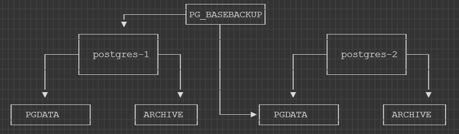

# How to replicate PostgreSQL

So far we've learnt how to run PostgreSQL as per [chapter 1](../1-introduction/README.md). </br>
We've also learnt how to configure PostgreSQL with our custom configuration file as per [chapter 2](../2-configuration/README.md). </br>

In this chapter we will setup a second PostgreSQL instance. </br>
Then we will learn how to configure our first PostgreSQL instance to replicate its data to the new second instance. </br>
This will essentially give us a primary and a secondary server for better availability in case we lose our primary server. </br>

## Get our Primary PostgreSQL up and running

Let's start by running our primary PostgreSQL in docker </br>

Few things to note here: </br>
* We start our instance with a different name to identify it as the first instance with the `--name postgres-1` flag and `2` for the second instance
* Set unique data volumes for data between instances
* Set unique config files for each instance
* Create and run our docker containers on the same network 

Create a new network so our instances can talk with each other:

```
docker network create postgres
```

Start with instance 1: 

```
cd storage/databases/postgresql/3-replication

docker run -it --rm --name postgres-1 `
--net postgres `
-e POSTGRES_USER=postgresadmin `
-e POSTGRES_PASSWORD=admin123 `
-e POSTGRES_DB=postgresdb `
-e PGDATA="/data" `
-v ${PWD}/postgres-1/pgdata:/data `
-v ${PWD}/postgres-1/config:/config `
-v ${PWD}/postgres-1/archive:/mnt/server/archive `
-p 5000:5432 `
postgres:15.0 -c 'config_file=/config/postgresql.conf'
```

## Create Replication User

In order to take a backup we will use a new PostgreSQL user account which has the permissions to do replication. </br>

Let's create this user account by logging into `postgres-1`:

```
docker exec -it postgres-1 bash

# create a new user
createuser -U postgresadmin -P -c 5 --replication replicationUser

exit
```

# Enable Write-Ahead Log and Replication

There is quite a lot to read about PostgreSQL when it comes to high availability. </br>

The first thing we want to take a look at is [WAL](https://www.postgresql.org/docs/current/wal-intro.html) </br>
Basically PostgreSQL has a mechanism of writing transaction logs to file and does not accept the transaction until its been written to the transaction log and flushed to disk. </br>

This ensures that if there is a crash in the system, that the database can be recovered from the transaction log. </br>
Hence it is "writing ahead". </br>

More documentation for configuration [wal_level](https://www.postgresql.org/docs/current/runtime-config-wal.html) and [max_wal_senders](https://www.postgresql.org/docs/current/runtime-config-replication.html)
```
wal_level = replica
max_wal_senders = 3
```

# Enable Archive

More documentation for configuration [archive_mode](https://www.postgresql.org/docs/current/runtime-config-wal.html#GUC-ARCHIVE-MODE)

```
archive_mode = on
archive_command = 'test ! -f /mnt/server/archive/%f && cp %p /mnt/server/archive/%f'

```

## Take a base backup

To take a database backup, we'll be using the [pg_basebackup](https://www.postgresql.org/docs/current/app-pgbasebackup.html) utility. </br>

The utility is in the PostgreSQL docker image, so let's run it without running a database as all we need is the `pg_basebackup` utility. <br/>
Note that we also mount our blank data directory as we will make a new backup in there: 

```
cd storage/databases/postgresql/3-replication

docker run -it --rm `
--net postgres `
-v ${PWD}/postgres-2/pgdata:/data `
--entrypoint /bin/bash postgres:15.0
```

Take the backup by logging into `postgres-1` with our `replicationUser` and writing the backup to `/data`.

```
pg_basebackup -h postgres-1 -p 5432 -U replicationUser -D /data/ -Fp -Xs -R
```

Now we should see PostgreSQL data ready for our second instance in `${PWD}/postgres-2/pgdata`

## Start standby instance

```
cd storage/databases/postgresql/3-replication

docker run -it --rm --name postgres-2 `
--net postgres `
-e POSTGRES_USER=postgresadmin `
-e POSTGRES_PASSWORD=admin123 `
-e POSTGRES_DB=postgresdb `
-e PGDATA="/data" `
-v ${PWD}/postgres-2/pgdata:/data `
-v ${PWD}/postgres-2/config:/config `
-v ${PWD}/postgres-2/archive:/mnt/server/archive `
-p 5001:5432 `
postgres:15.0 -c 'config_file=/config/postgresql.conf'
```

## Test the replication

Let's test our replication by creating a new table in `postgres-1` </br>
On our primary instance, lets do that:

```
# login to postgres
psql --username=postgresadmin postgresdb

#create a table
CREATE TABLE customers (firstname text, customer_id serial, date_created timestamp);

#show the table
\dt
```

Now lets log into our `postgres-2` instance and view the table:

```
docker exec -it postgres-2 bash

# login to postgres
psql --username=postgresadmin postgresdb

#show the tables
\dt
```

## Failover 

Now lets say `postgres-1` fails. </br>
PostgreSQL does not have built-in automated failver and recovery and requires tooling to perform this. </br>

When `postgres-1` fails, we would use a utility called [pg_ctl](https://www.postgresql.org/docs/current/app-pg-ctl.html) to promote our stand-by server to a new primary server. </br>

Then we have to build a new stand-by server just like we did in this guide. </br>
We would also need to configure replication on the new primary, the same way we did in this guide. </br>

Let's stop the primary server to simulate failure:

```
docker rm -f postgres-1
```

Then log into `postgres-2` and promote it to primary:
```
docker exec -it postgres-2 bash

# confirm we cannot create a table as its a stand-by server
CREATE TABLE customers (firstname text, customer_id serial, date_created timestamp);

# run pg_ctl as postgres user (cannot be run as root!)
runuser -u postgres -- pg_ctl promote

# confirm we can create a table as its a primary server
CREATE TABLE customers (firstname text, customer_id serial, date_created timestamp);
```

That's it for chapter three! </br>
Now we understand how to [run PostgreSQL](../1-introduction/README.md), how to [configure PostgreSQL](../2-configuration/README.md) and how to setup replication for better availability.

## Summary


